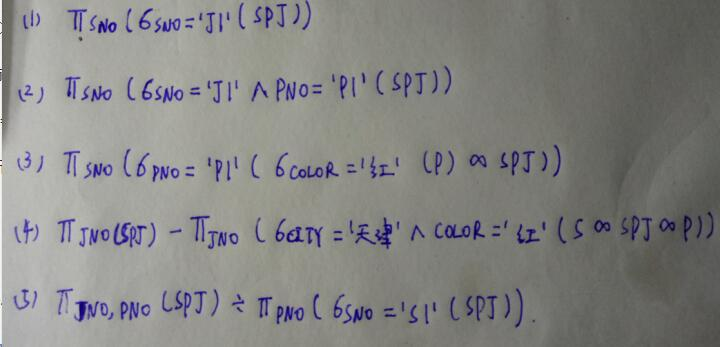
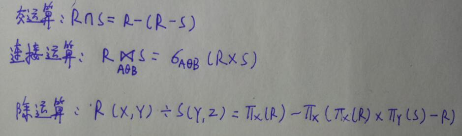

# 习题一 &nbsp;&nbsp;Page70
## 16020031091 &nbsp;杨燊
- 1.关系模型的三个组成部分  
答：关系数据模型的数据结构、操作集合、完整性约束

- 5.关系模型的完整性规则？什么情况下外码可以是空值？  
答：关系模型的完整性规则是对关系的某种约束条件，也就是关系的值随着时间变化应该满足一些约束条件，其中有三种完整性约束：实体完整性、参照完整性和用户定义的完整性；在参照完整性中，外部码的属性值可以为空值

- 6.用关系代数完成SPJ数据库查询  
(1）求供应工程J1零件的供应商号码SNO：    
(2）求供应工程J1零件P1的供应商号码SNO：  
(3）求供应工程J1零件为红色的供应商号码SNO：  
(4）求没有使用天津供应商生产的红色零件的工程号JNO：  
(5）求至少用了供应商S1所供应的全部零件的工程号JNO：  
答:

- 7.等值连接与自然连接的区别和联系  
答：区别：自然连接要求两个关系中相等的分量必须是相同属性组，而等值连接不必，自然连接要在结果中把重复的属性去掉；  
联系：自然连接是一种特殊的等值连接

- 8.关系代数的基本运算？如何用这些基本运算来表示其他运算？  
答：并、差、笛卡尔积、投影和选择五种运算为基本的运算；  
表示其他三种运算：
