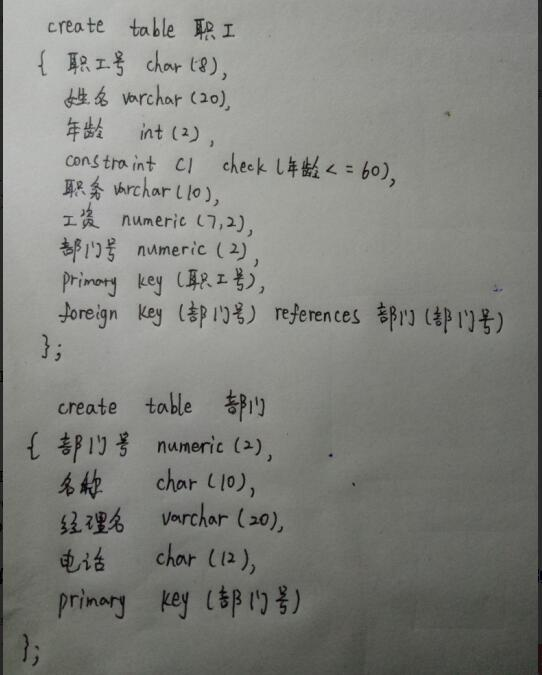

# 习题五 &nbsp;&nbsp;Page173
## 16020031091 &nbsp;杨燊
- 4.RDBMS的完整性控制机制应具有哪三个方面的功能？  
答：（1）定义功能：即提供定义完整性约束条件的机制  
（2）检査功能：即检查用户发岀的操作请求是否违背了完整性约束条件违约处理  
（3）违约处理：如果发现用户的操作请求使数据违背了完整性约束条件,则采取一定的动作来保证数据的完整性
- 5.RDBMS在实现参照完整性约束时需要考虑哪些方面？  
答：（1）被参照的属性必须在被参照的表中定义为主码。  
（2）被参照的属性和参照的属性数据类型必须一致。  
（3）参照的属性取值范围不得超出被参照属性的值域，可以为空值。
- 6.答：  
（1）

- 7.RDBMS违反实体完整性、参照完整性和用户定义的完整性约束条件时，分别如何处理？   
答：对于违反实体完整性和用户定义的完整性的操作一般都采用拒绝执行的方式进行处理。而对于违反参照完整性的操作,并不都是简单地拒绝执行,有时要根据应用语义执行一些附加的操作,以保证数据库的正确性